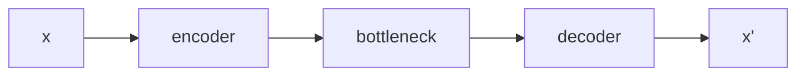

https://arxiv.org/pdf/2204.06125.pdf

https://openai.com/dall-e-2/

## 1 play for fun

https://www.craiyon.com/

https://github.com/borisdayma/dalle-mini

## 2 milestones

DALLE（01/21）----Eg View(05/21)----NvWA（11/21）----GLIDE(12/21)----ERNZE·ViLG（12/21）----DALLE2(04/12)----CogView(04/22)----CogVideo(05/22)----Imagen(05/22)

## 3 论文介绍(unclip)

基于clip：zero-shot（无需额外训练）

FID(**Fréchet Inception Distance**)是从原始图像的计算机视觉特征的统计方面，来衡量两组图像的相似度，是计算真实图像和生成图像的特征向量之间距离的一种度量。

diffusion model:guidance technique牺牲一部分的多样性达到更好的保真度

### 3.1 clip模型

从文本编码器得到文本对应的特征，从图像编码器得到一个图像特征，然后对应的正确内容就是正样本，否则其他都是负样本

通过对比学习，能够让两者学习的更好，两者的联系也就建立起来

> 此处的clip模型一旦训练完毕就固定，不会再后续进行训练和fine tune(微调)

### 3.2 二阶段训练过程

- 首先通过clip得到的文本编码器，得到文本特征，然后此时由对应生成的图像编码器生成的图像特征，作为其ground truth，训练得到prior模型

（为什么详见diffusion的介绍）

- 然后利用常规的diffusion，解码器生成对应的图像(GLIDE)

### 3.3 基础知识介绍

AE(auto-encoder):自动编码

DAE(mask-AE):带有大量噪声，或者掩码内容的自动编码

VAE(Variational Auto-encoder):

****

https://www.bilibili.com/video/BV15E411w7Pz/?spm_id_from=333.337.search-card.all.click&vd_source=c3c36df311158cd049a5c20e3e2e5beb

https://www.bilibili.com/video/BV1aE411o7qd?p=70&vd_source=c3c36df311158cd049a5c20e3e2e5beb

VQ-VAE：

- 将原来的分布z离散化，更符合现实生活中的内容
- 从codebook中找到与之最接近的聚类中心，生成一个one-hot图表

### 3.4 guidance classifier 

在反向传递过程中增加一个传统分类网络，让其逼真度提高

使用之前提到的clip网络能更好的实现将文本信息融合进入带有大量噪声图片的训练过程

但是这些网络训练成本大，可以采用classifier free guidance，即比较含有参数y（文本信息）、与随机剔除这一特征的差值，然后在图像生成过程中就能使用这个差值来衡量此步与带有文本标签的ground truth的差距

## 4 method

样本集：图像文本对

生成大尺寸图片：先从64×64开始一步步扩大，为了训练稳定性，在这里加入了大量的噪声，这里只是使用了cnn，而没有采用transformer模型。不需要添加位置编码。

prior：

论文的主要内容就是将clip+一个二阶段网络结合起来，其他都在前文中已经提出了。

